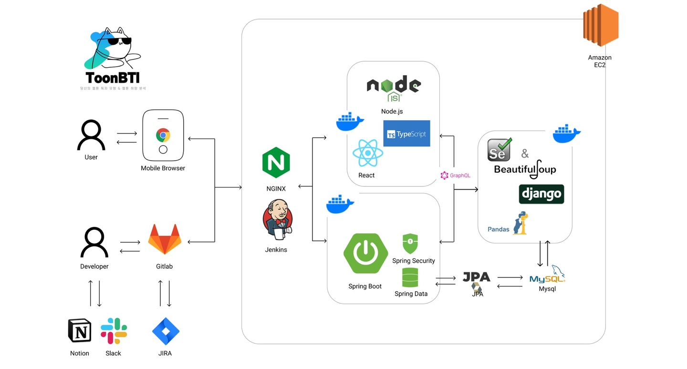

# ToonBTI : 웹툰 취향 분석 테스트

## **목차**

1. [간단 소개](#1-간단-소개)

   1. [💚 프로젝트 진행기간](#💚-프로젝트-진행기간)
   1. [💛 TOONBTI?](#💛-toonbiti)
   1. [💜 기술 스택 및 Version](#💜-기술-스택-및-version)
   1. [💙 프로젝트 구조도](#💙-프로젝트-구조도)

1. [협업](#2-협업)

   1. [💚 Ground Rules](#💚-ground-rules)
   1. [🧡 Git 활용했어요](#🧡-git-활용했어요)
   1. [❤️ Notion 활용했어요](#❤️-notion-활용했어요)
   1. [💙 팀원 구성 및 소개](#💙-팀원-구성-및-소개)

1. [프로젝트](#3-프로젝트)
   1. [💚 기획의도](#💚-기획의도)
   1. [❤️ 문제점](#❤️-문제점)
   1. [💛 해결](#💛-해결)
   1. [💙 프로젝트 소개 및 목적](#💙-프로젝트-소개-및-목적)
   1. [🧡 프로젝트 기술 스택](#🧡-프로젝트-기술-스택)
   1. [💜 주요 기능을 소개합니다!](#💜-주요-기능을-소개합니다)
   1. [💚 프로젝트 시연화면](#💚-프로젝트-시연화면)
   1. [❤️ 공정률](#❤️-공정률)
   1. [💛회고](#💛-회고)

---

## **1. 간단 소개**

### 💚 프로젝트 진행기간

<p> 2023/2/17 - 2023/4/7 </p>
<p> SSAFY 8기 특화 프로젝트 </p>

### 💛 TOONBITI?

내가 웹툰 속의 주인공이라면 누구일까? 유형 검사를 통해 웹툰 속의 나를 찾는 서비스!

웹툰 독자 유형 검사를 통해 주인공인 나를 발견하고, 취향에 맞는 웹툰을 추천 받자.

### 💜 기술 스택 및 Version

```
 # Backend
 development tool : Intellij IDEA 2022.3.2
 spring boot : 2.7.7
 gradle : 7.6
 jdk : zulu-11
 my sql : 8.0.31
 graphQL
 lombok
 Spring Data JPA
 Spring Security
 Spring Web
```

```
 # Frontend
 development tool : Visual Studio Code
 npm
 node.js : 18.15
 React 18
 react-router : v6.
 graphql : 16.6
 typescript : 4.9
 styled-components : 5.3
```

```
 # CI/CD
 AWS EC2
 Jenkins
 NGINX
 Docker
```

```
 # 그 외 협업툴
 Git, source tree - 브랜치 전략을 통해 기능 분리
 Notion - 전체적인 회의 관할 및 모든 메모
 JIRA - 주단위 목표량 설정 및 할일 배분
 Slack - 빌드 소식 확인용
```

### 💙 프로젝트 구조도

```
# B.E.
toonbti
  ├── global
  │   ├── config
  ├── resouces
  │   ├── graphql.schema
  ├── domain
  │   ├── controller
  │   ├── model
  │   │   ├── dto
  │   │   ├── entity
  │   │   ├── repository
  └── └── └── service
```

#### F.E

```
# F.E.
toonbti
  ├── public
  │   └── index
  ├── src
  │   ├── assets
  │   ├── components
  │   ├── pages
  │   ├── App
  │   ├── index
  │   ├── types
  │   └── config
  └── package
```

## **2. 협업**

### 💚 Ground Rules

1. 매주 월요일 아침 감사 인사하기
2. 매일 오전/오후 Daily Scrum Meeting 하기 (오늘 할 일, 오늘 한 일 공유)
3. 화내지 않기❌ 짜증내지 않기❌
4. 의견 공유는 오픈 마인드로 받아들이기
5. 니것 내것 나누지 말고 우리는 **팀**이라는 걸 알아주세요😁
6. 팀원을 믿지만 코드는 한 번 더 확인하기 (MR 후 **코드 리뷰**)
7. **재채기하면 Bless you~! 해주기**🤧

### 🧡 Git 활용했어요

Requisite

- Github flow를 준수합니다
- 원활한 개발을 위해 Gitlab Issue탭을 적극 활용해주세요
- 작업을 마치고나서 feature 브랜치를 일일히 rebase할 필요는 없습니다.
  - 하루 이상 지난 feature branch의 경우에는 **아침에 반드시 rebase** 해주세요
  - gitlab에서 알아서 rebase 해줍니다
- main, frontend, backend에 push할 수 없습니다 (maintainers 제외)
- main, frontend, backend에 force-push할 수 없습니다

Develop - Todo

1. Gitlab에 issue를 등록합니다
   - 새로운 기능일 경우, "enhancement" label을 달아주세요
   - 이미 닫힌 이슈를 보완 및 수정해야할 경우, "duplicate" label을 달아주세요
2. 등록한 issue에서 브랜치를 생성합니다
3. issue탭에서 생성한 브랜치로 작업합니다

Develop - In progress

1. 해당 이슈에서 작업 중 유용한 레퍼런스나 기술적 조언은 comment로 달아주세요
2. 코드리뷰가 필요시 MR(Merge Request)로 만들어주세요
   - "help wanted" label을 달아주세요
3. commit
   - .gitignore에 staged 할 필요없는 파일들을 등록해주세요
   - gitmessage.txt에 commit message template을 참고합니다
   - git add . && git commit

Develop - Done

1. 작업을 완료했다면 작업브랜치를 푸시해주세요
2. Gitlab에서 MR을 생성합니다
   - Source branch (feature-branch) into Target branch (frontend or backend)
3. 리뷰 후에 Rebase 및 Merge 합니다

Reference

- [Github flow](https://ujuc.github.io/2015/12/16/git-flow-github-flow-gitlab-flow/)
- [Semi-linear merge](https://devblogs.microsoft.com/devops/pull-requests-with-rebase/)
- [Continuous Integration](https://martinfowler.com/articles/continuousIntegration.html)

### 💙 팀원 구성 및 소개

- **B.E**

  | 팀원      | 역할                                 | 이메일                  | Github                              |
  | --------- | ------------------------------------ | ----------------------- | ----------------------------------- |
  | 권성은 👑 | 팀장, CI/CD, SpringBoot 설계 및 개발 | sungeun.kweon@gmail.com | https://github.com/hellowco         |
  | 김진호    | Django 설계 및 개발                  | isagkim@gmail.com       | https://github.com/No88888888       |
  | 전주영    | DB 설계 및 관리                      | wjswndud53@gmail.com    | https://github.com/charoon-wjswndud |

- **F.E**

  | 팀원   | 역할                           | 이메일                   | Github                        |
  | ------ | ------------------------------ | ------------------------ | ----------------------------- |
  | 김태원 | F.E 팀장, 프론트 관리 및 개발  | taw4654@gmail.com        | https://github.com/DanKim0213 |
  | 윤지영 | 디자인, 공통 layout 개발 및 QA | diniless7@gmail.com      | https://github.com/yoonjyjy   |
  | 노현정 | React 개발 및 기술 연구        | nohhyunjeong93@gmail.com | https://github.com/isabel-noh |

### ❤️ 팀원 역할

**김태원**

- [graphql](https://graphql.org/)을 백엔드와 프론트엔드에 도입 및 [graphql-codegen](https://the-guild.dev/graphql/codegen)을 활용하여 설정
- [Intersection Observer](https://developer.mozilla.org/en-US/docs/Web/API/Intersection_Observer_API)를 활용하여 무한 스크롤 기능을 웹툰 목록 페이지에 적용
- 취향 테스트 페이지에서 연관 웹툰 아이템을 불러올때, 중복된 웹툰을 [Map](https://developer.mozilla.org/en-US/docs/Web/JavaScript/Reference/Global_Objects/Map) 자료형을 사용하여 거르기
- [TypeScript](https://www.typescriptlang.org/)를 프론트엔드에 적용하여 컴포넌트별 propstype 및 graphql API에서 빠른 디버깅과 협업에 안정성을 추구
- [Github flow](https://ujuc.github.io/2015/12/16/git-flow-github-flow-gitlab-flow/)를 도입하여 팀 프로젝트 코드관리를 도맡아 진행

**노현정**

- [Apollo Clinet](https://www.apollographql.com/docs/react/)를 사용하여 [GraphQL](https://graphql.org/) API 호출 및 통신
- [ChartJs](https://www.chartjs.org/docs/latest/)를 활용한 데이터 시각화
- 컴포넌트 재사용성 증진을 위한 컴포넌트 공통화
- Styled-components의 [Themeprovider](https://styled-components.com/docs/api#themeprovider)을 활용한 공통 스타일 속성 관리
- 디자인 QA 및 수정

**윤지영**

- 전체적 디자인 : 피그마 작성 및 [Styled-Component](https://styled-components.com/)를 이용하여 전체적 디자인 구성
- 독자 유형 테스트 페이지 : 유형 테스트 설계 및 유형별 설명 기획 및 useState를 이용하여 유형테스트 화면 구현
- 독자 유형 테스트 결과 페이지 : 해당하는 독자 유형과 나와 잘 맞는 유형, 가장 많은 유형 등 구현
- 전체 유형 보기 : 각 유형별 결과 모달로 확인 가능하도록 구현
- 카카오톡 API를 활용한 [공유하기](https://developers.kakao.com/docs/latest/ko/message/rest-api) 기능 구현
- 취향 분석 결과 페이지 : 유형별 독자 맞춤 추천 웹툰 리스트 구현 및 Api 연결

**권성은**

- Java 및 [Springboot](https://spring.io/projects/spring-boot)를 활용한 GraphQL API 구현
- [Docker](https://www.docker.com/) 및 [Jenkins](https://www.jenkins.io/)를 활용한 CI/CD 구축
- [AWS EC2](https://aws.amazon.com/ko/ec2/) 및 [Nginx](https://www.nginx.com/) 서버 관리
- python 데이터 수집 및 전처리
- MySQL DB 설계
- 포팅 메뉴얼 문서화

**김진호**

- [BeautifulSoup](https://beautiful-soup-4.readthedocs.io/en/latest/), [Selenium](https://www.selenium.dev/) 라이브러리를 활용한 웹툰 데이터 자동 크롤링
- [Django](https://www.djangoproject.com/)와 [Pandas](https://pandas.pydata.org/), [Cosine](https://docs.scipy.org/doc/scipy/reference/generated/scipy.spatial.distance.cosine.html#scipy.spatial.distance.cosine) 라이브러리를 활용한 웹툰 추천 알고리즘 구축
- Django에서 Graphql을 활용한 API 설계

**전주영**

- 관계형 데이터베이스를 설계하고 관리
- 크롤링한 데이터를 파이썬을 이용해 전처리
- 전처리한 데이터를 데이터베이스에 저장
- notion, google Drive를 활용해서 산출물 정리

## **3. 프로젝트**

### 💚 기획의도

웹툰을 좋아하는 사람들에게 통합적으로 웹툰을 추천해줄만한 사이트가 필요하다. 대형 웹툰 사이트, 예를들어 네이버 웹툰이나 카카오 페이지, 같은 곳에서는 같은 플랫폼의 웹툰만을 추천해줄 뿐이었다. 이를 해결하기위해 ToonBTI를 기획하였다.

### ❤️ 문제점

웹툰 추천 서비스는

- 웹툰을 추천 서비스로 사람들을 묶어놓을 수 없다. (자체 콘텐츠가 없으니)
- 네이버 웹툰 및 카카오 페이지 내에 자체적인 웹툰 추천 서비스가 있다.

### 💛 해결

TooNBTI 서비스를 생각했다.

- 사용자들을 묶어놓을 포인트 -> 게임성 + 공유
- 자체 웹툰 추천 -> 자체 설문조사를 통해 빅데이터로 나에게 맞는 웹툰 추천

### 💙 프로젝트 소개 및 목적

1. 웹툰 독자 유형 테스트

   - 설문조사 -> 독자 유형
   - Light / Heavy
   - Strong / Weak
   - Romance / Event
   - Alone / Together

2. 웹툰 취향 분석 서비스

   - 재밌게 읽은 웹툰 선택 -> 선택된 웹툰 기반 취향 분석 -> 취향에 맞는 웹툰 추천

### 🧡 프로젝트 기술 스택



### 💜 주요 기능을 소개합니다!

1️. 웹툰 독자 유형 검사

- 세분화된 16가지 유형 중 자신의 유형을 알 수 있습니다.
- 유형별 선호 웹툰을 추천합니다
- 사용자 기반 추천 알고리즘으로 데이터 양과 비례해서 질 좋은 추천이 가능합니다

2️. 웹툰 취향 분석 검사

- 사용자가 읽은 웹툰을 분석해 웹툰을 추천합니다
- 웹툰을 선택하면 비슷한 작품들로 리스트 업데이트되어 기억하지 못한 웹툰까지 입력할 수 있습니다
- 작가, 작품명으로 키워드 검색이 가능합니다

3️. 공유하기

- 검사 결과를 카카오톡이나 링크로 공유할 수 있습니다

### 💚 프로젝트 시연화면

- 목차

1. 시작 페이지 및 독자 유형 테스트 페이지
2. 독자 유형 결과 페이지
3. 전체 유형 순위 페이지
4. 공유하기 기능
5. 웹툰 취향 분석 테스트 - 작품 선택 및 추가
6. 웹툰 취향 분석 테스트 - 검색을 통한 선택
7. 웹툰 취향 분석 테스트 - 무한 스크롤 기능
8. 취향 분석 결과 페이지

</br>

1. 시작 페이지 및 독자 유형 테스트 페이지

- 서비스에 접속하여 독자 유형 테스트 진행 가능

   </br>
   

   </br>

2. 독자 유형 결과 페이지

- 독자 유형 테스트에 따른 결과 확인 가능

   </br>
   

   </br>

3. 전체 유형 순위 페이지

- 각 유형을 누르면 모달창을 통해 유형별 설명 추가 확인
- 가능 가장 많이 나온 유형순으로 배열
- 독자 유형 기준 설명

  </br>
  

  </br>

4. 공유하기 기능

- 좌측 URL 버튼 클릭 시 클립보드에 해당 결과 페이지 URL 복사로 직접 공유 가능
- 우측 카카오톡 공유하기 버튼 클릭 시 카카오톡 API 연결을 통해 공유하기 실행

  </br>
  

  </br>

5. 웹툰 취향 분석 테스트 - 작품 선택 및 추가

- 미리 데이터베이스에 저장된 웹툰들을 전체 유저에게 선호도가 높았던 순으로 노출
- 자신이 재미있게 봤던 웹툰을 클릭 시 그와 관련된 장르의 작품이 최대 3개까지 목록에 추가됨

  </br>
  

  </br>

6. 웹툰 취향 분석 테스트 - 검색을 통한 선택

- 원하는 작품이 리스트에서 찾기 어려울 경우 위의 검색창을 통해 작품명과 작가명으로 검색이 가능함

  </br>
  

  </br>

7. 웹툰 취향 분석 테스트 - 무한 스크롤 기능

- 초기 주어진 웹툰 리스트가 끝까지 도달되었을 때, 추가적으로 리스트를 호출하여 추가

  </br>
  

  </br>

8. 취향 분석 결과 페이지

- 앞에서 선택된 웹툰들을 기반으로 취향을 분석해주는 페이지
- 읽었다고 체크한 웹툰의 수를 기준으로 상위 몇 %인지 확인
- 선호 플랫폼, 장르, 완결작 선호 여부 등을 요약하여 출력
- 동일 유형의 독자들이 좋아하는 작품을 완결작, 미완결작으로 나누어 추천
- 사용자가 즐겨보는 키워드 분석 및 해당 키워드를 통한 추천작 확인 가능
- 사용자가 선호한 장르의 대표 작가 추천

  </br>
  

  </br>

### ❤️ 공정률

- 백엔드 기획 API 24 개 중 18개 완료 (75%)
- 프론트엔드 기획 기능 46개 중 32개 완료 (70%)

### 💛 회고

- 권성은: 도메인 내에서 주제를 정하는 것이 어려워 기획에 시간을 많이 쏟았고, 이로 인해 개발 시간이 부족했다. 또한 팀원의 역량 차이로 작업 분배에 어려움이 있었다. 하지만 팀원들의 꺾이지 않는 마음과 코치님들의 열정적인 도움으로 프로젝트를 성공적으로 완료할 수 있었다.
- 김진호: 팀 의사결정 방식을 재고해 볼 수 있는 좋은 경험이었다. 열정적인 토의가 이루어진다하더라도 소수의 결정권자가 있어야 빠른 프로젝트 진행이 가능하다는 것을 배웠다.
- 전주영: 프로젝트 기간에 절반 가까이 기획을 투자햇고 남은 시간 안에 개발하다 보니 기획 그대로 구현하기 어려웠습니다. 하지만 팀원들과 일심동체 상부상조하여 프로젝트를 끝마칠 수 있었습니다.
- 노현정: 기획의 중요성을 다시 한번 되새길 수 있었다. 서비스의 방향이나 아이디어를 나 자신을 설득할 수 없는데 사용자를 설득하는 것은 불가능할 것이다. 사용자가 왜 이 서비스를 이용할까를 먼저 생각해보아야겠다.
- 윤지영: 빠르고 탄탄한 기획 단계와 꼼꼼한 일정 관리의 중요성을 느낄 수 있었고, 중간중간 남은 일을 계속 체크하며 진행해야 한다는 것을 절실히 깨달았다. 너무 많은 갈아엎기와 무수한 오류 발생으로 진이 빠졌지만 완주했다는 것이 뿌듯하다.
- 김태원: 6주라는 기간에 적합한 프로젝트 규모에 대해 재고할 수 있었고, 우선순위를 정해 개발 일정을 조율하는 경험을 할 수 있었습니다. 매일 아침 스크럼 미팅으로 소통하며 프로젝트를 끝마칠 수 있었습니다.
